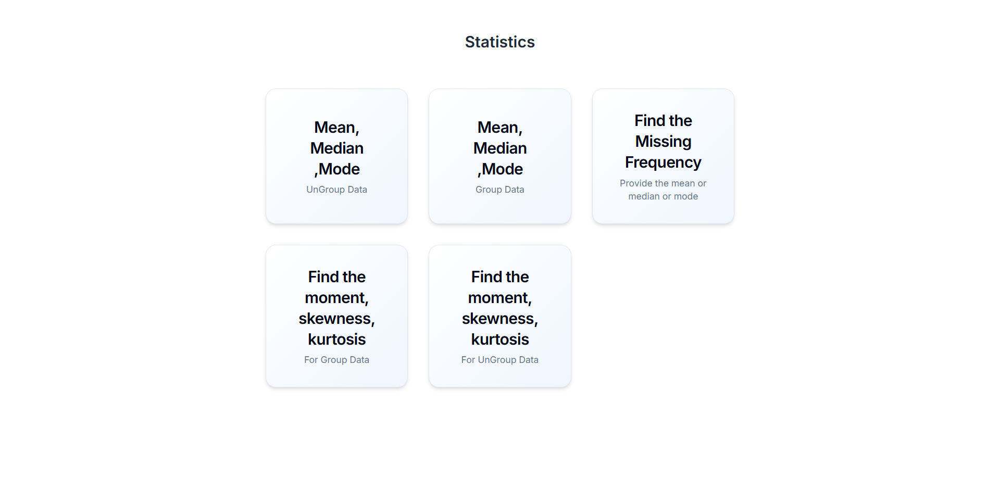

# Statistics Dashboard

A modern, responsive React/Next.js dashboard for computing descriptive statistics—Mean, Median, Mode, Missing Frequency, Moments, Skewness, and Kurtosis—with an engaging UI powered by Tailwind CSS and NextUI.

## Demo

> **Live Preview:** [Statistics Dashboard Demo](https://mean-median-mode-alpha.vercel.app/)



## Features

- **Mean, Median, Mode** (Ungrouped & Grouped Data)
- **Find Missing Frequency** given mean (μ), median (˜x), or mode
- **Moments, Skewness, Kurtosis** (Ungrouped & Grouped Data)
- **Responsive Grid** layout: 1–3 columns across mobile, tablet, desktop
- **Hover Animations** & **Lift Effects** for tactile feedback
- **Iconography** for quick visual scanning
- **Light, Modern Design** with subtle gradients and shadows

## Tech Stack

- **Framework:** Next.js 14 / React 18
- **Styling:** Tailwind CSS
- **Components:** NextUI
- **Icons:** react-icons (Feather)
- **Deployment:** Vercel (recommended)

## Getting Started

### Prerequisites

- Node.js v16 or higher
- npm, yarn, or pnpm package manager

### Installation

```bash
# Clone the repo
git clone https://github.com/Hitesh-s0lanki/mean-median-mode
cd statistics-dashboard

# Install dependencies
npm install
# or
# yarn install
# or
# pnpm install
```

### Development

```bash
# Start the development server
npm run dev
# or
# yarn dev
# or
# pnpm dev
```

Open your browser to [http://localhost:3000](http://localhost:3000) to see the dashboard.

### Production Build

```bash
# Build for production
npm run build
npm start
# or
# yarn build && yarn start
```

## Usage

1. Navigate to the **Statistics** page.
2. Choose the statistic card you want (Mean/Median/Mode, Missing Frequency, Moments, etc.).
3. Input your dataset (ungrouped raw values or grouped frequency table).
4. View instant results and formulas.

---

**Enjoy building with data?** ⭐️ If you find this project helpful, please give it a star on GitHub!
